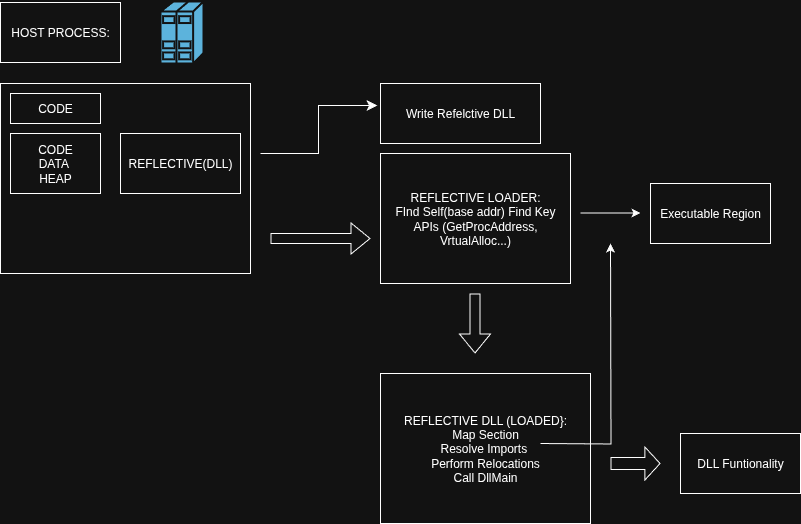

# Best Dynamicall APIS for dinamically:

- DllMain
- LoadLibraryEx
- CreateProcess


1. DllMain:

```C++
#include <windows.h>

BOOL WINAPI DllMain(
	HINSTANCE histDLL, // handle to Dll module
	DWORD fdwReason, // Reason for callin funtion
	LPVOID lpvReserverd, // reserved
	)
{
	// Perform actions based on the reason for calling

	switch (fdwReason)
	{
	case DLL_PROCESS_ATTACH:
		// Iniciate once for each process.
		// Return FALSE to fail DLL load.
		break;

	case DLL_THREAD_ATTACH:
		// Do Thread-specific initialization.
		break;

	case DLL_THREAD_DETACH:
		// Do thread-specific cleanup.
		break;

	case DLL_PROCESS_DETACH:
		break;

	case DLL_PROCESS_DETACH:
		if (lpvReserved != nullptr)
		{
			break; // Do not do cleanup if process termination scenario
		}
		// Reform any necessary cleanup.
		break;
	}
	return TRUE; // Successfull DLL_PROCESS_ATTACH
}
```

- Syntax:
```c++
BOOL WINAPI DllMain(
_In_ HINSTANCE hinstDLL,
_In_ DWORD  fdwReason,
_In_ lpvReserved,
)
```

- Parameters:
    - hinstDLL[In]:
    The value the HINSTANCE of DLL is the same as the [HMODULE] of the DLL, so hinstDLL can be used in calls fintions that require a module hanldle.
    - fdwReason[In]:
    The reason code indicated the DLL entry-point:
        - DLL_PROCESS_ATTACH: Is loaded into the virtual address space of the current process as a result of the process starting up the result of a call to [Load-Library](https://learn.microsoft.com/en-us/windows/win32/api/libloaderapi/nf-libloaderapi-loadlibraryaa).
          DLLs can use this opportunity to initialize any intance data or to use the [TlsAlloc](https://learn.microsoft.com/en-us/windows/win32/api/processthreadsapi/nf-processthreadsapi-tlsalloc).
        - DLL_PROCESS_DETACH: Is begin unluoded from the virtual address space of the calling process cause it was loaded  unsuccessfully or the reference count has reached zero. The terminated or called Freelibrary one time for each time it called
          [LoadLibrary](https://learn.microsoft.com/en-us/windows/win32/api/libloaderapi/nf-libloaderapi-loadlibrarya). The lvpReserved parameter indicates whether the DLL is begin unloaded  as a
          result of a [Freelibrary](https://learn.microsoft.com/en-us/windows/win32/api/libloaderapi/nf-libloaderapi-freelibrary) proccess termination.
        - DLL_THREAD_ATTACH: Creating Threads, the systme calls the entry point funtion of all DLLs currently attached to the process. The call is made the context of hte new thread.
          DLLs can use this opportunity to initialize a TLS slot for the thread. DLL_PROCESS_ATTACH does not call DLL entry-point funtion with DLL_THREAD_ATTACH.
        - DLL_THREAD_DETACH: Is exiting cleanly. If the DLL has stored a pointer to allocated memory in a TLS slot, it should use this opportunity to free memory. The system call the entry-point funtion all currently loaded DLL wih the value.

    - lpvReserved[in]:
      If fdwReason is DLL_PROCESS_ATTACH, lpvReserved is [NULL] for dynamic loads and non-NULL for static loads.
      If fdwReason is DLL_THREAD_DETACH, lpvReserved is [NULL] if Freelibrary has  been calledor the DLL load failed and non-NULL if the proccess terminating.


- Remarks:
When handling [DLL_PROCESS_DETACH], the DLL should free resources such as heap memory only if the DLL is begin unloaded dynamically. If the process is teminating all[the lpvReserved is non-NULL] all
threads in the process except the current thread either have exited already or have benn explicity teminate by call to [ExitProcces].

If u use the [TerminateProcess o TeminateJobObject], the DLL dont notify the DLL_PROCESS_DETACH notifications. If terminate the threads with [TerminateThread], the DLL dont notify the
DLL_THREAD_DETACH.


2. LoadLibraryExA(libloadaerapi.h)

- Syntax:
```C++
HMODULE LoadLibraryExA(
    [in] LPCSTR lpLibFileName,
         HANDLE hFIle,
    [in] DWORD DwFlags
);
```
- Example of code:
First we must to create the my_library.cpp
```C++
#include <windows.h>
#include <iostream>

#ifdef DLL_EXPORTS
#define DLL_API __declspec(dllexport)
#else
#define DLL_API __declspec(dllimport)
#endif

// Export funtion

extern "C" DLL_API void My_Funtion() {
	MessageBox(NULL, "HEY to DLLS", "My Library", MB_OK);
}

// Dll Main
BOOL WINAPI DllMain(HINSTANCE hinstDLL, DWORD fdwReason, LPVOID lpvReserved) {
	switch (fdwReason)
	{
	case DLL_PROCESS_ATTACH:
		// Load memory
		std::cout << "SUSCESS LOAD DLL." << std::endl;
		break;
	case DLL_PROCESS_DETACH:
		// Dowload the memory:
		std::cout << "SUSCESS DOWNLOAD DLL." << std::endl;
		break;
	}
	return TRUE;
}
```
Copiled `g++ -shared -o my_library.dll my_library.cpp -DDLL_EXPORTS`

Then Create the code for loading LoadDll.cpp
```C++
#include <iostream>
#include <windows.h>

int main() {
	// Name of the DLL to want loaded.
	const char* dll_path = "my_library.dll";

	//Flags to control the loads.

	DWORD flags = LOAD_LIBRARY_AS_DATAFILE;

	// Load the DLL

	HMODULE hModule = LoadLibraryExA( dll_path, NULL, flags);
	if (hModule != NULL) {
		std::cout << "DLL '" << dll_path << "' SUSCESS LOAD." << std::endl;

	// Free libreary
		std::cout << "FREE DLL." << std::endl;

	}
	else {
		// ERROR
		DWORD error_code = GetLastError();
		std::cerr << "Error to Load DLL. Code error: " << error_code << std::endl;

	}
	return 0;

}
```
Copile the code for have the .exe `g++ .\LoadLibrary.cpp -o LoadLibrary.exe`
Execute the command:
```sh
 .\LoadLibrary.exe .\my_library.dll
DLL 'my_library.dll' SUSCESS LOAD.
FREE DLL.
```

- Parameters:
    -lpLibFileName:
    This name is not related to the name stored in a library module itself, as specified by the [Library] in the module defenition (.def). file.
    The module can be a library module[.dll] or an executable module[.exe]. The module is loaded as if DONT_RESOLVE_DLL_REFERENCES was specified.

    - hFIle
    This parameter is reserved for future use, must be NULL

    - [in] DwFlags:
    The action to be taken when loading module, if no flags are specified, the behaviour of this funtion is identical to that [LoadLibrary].
    Following values:
        1. DONT_RESOLVE_DLL_REFERENCES
        2. LOAD_IGNORE_CODE_AUTHZ_LEVEL
        3. LOAD_LIBRARY_AS_DATAFILE
        4. LOAD_LIBRARY_AS_EXCLUSIVE
        5. LOAD_LIBRARY_AS_IMAGE_RESOURCE
        6. LOAD_LIBRARY_SEARCH_APPLICATION_DIR
        7. LOAD_LIBRARY_SEARCH_DEF_DIRS
        8. LOAD_LIBRARY_SEARCH_DLL_LOAD_DIR
        9. LOAD_LIBRARY_SEARCH_SYSTME32
        10. LOAD_LIBRARY_SEARCH_USER_DIRS
        11. LOAD_WITH_ALTERED_SEARCH_PATH
        12. LOAD_LIBRARY_REQUIRE_SIGNED_TARGET
        13. LOAD_LIBRARY_SAFE_CURRENT_DIRS

ALl this values are in the [Page](https://learn.microsoft.com/en-us/windows/win32/api/libloaderapi/nf-libloaderapi-loadlibraryexa#syntax)

- Return Value:

IF the the successds, return the value is a handle to the load module. If no the return valus is NULL [GetLastERRO].

- Remarks:
 The funtion [LoadLibraryEx] funtion is very similar to [LoadLibrary] funtion. The difference:
    - LoadLibraryEx can load a DLL module without calling the [DllMain] funtion of the DLL.
    - LoadLibraryEx Can load a module in a way is optimized for the case where  the module will never be executed, loading the module as it were a data file.
    - LoadLibraryEx can find module and their associated modules by using either of two search strategies or it can search a process-specific set of directories.
 If the DwFlags is 0 hte [LoadLibraryEx] act like [LoadLibraryEx].
 In C++ compiler supports a syntax that enables to declare thread-local variables: [__declspec]. [Using thread Local storage in Dynamic Link Library](https://learn.microsoft.com/en-us/windows/win32/dlls/using-thread-local-storage-in-a-dynamic-link-library).
    - Loading a DLL as a Data file or image resources:
    The LOAD_LIBRARY_AS_DATAFILE, LOAD_LIBRARY_AS_EXCLUSIVE and LOAD_LIBRARY_AS_IMAGE_RESOURCE value affect the per-proccess reference count and the loading of the specified module.
    To determinate how a module was loadaded, use one of the Following macross to test the handle return by [LoadLibrary].
 ```C++
#define LDR_IS_DATAFILE(handle)      (((ULONG_PTR)(handle)) &  (ULONG_PTR)1)
#define LDR_IS_IMAGEMAPPING(handle)  (((ULONG_PTR)(handle)) & (ULONG_PTR)2)
#define LDR_IS_RESOURCE(handle)      (LDR_IS_IMAGEMAPPING(handle) || LDR_IS_DATAFILE(handle))
```

- Security Remarks:
LOAD_LIBRARY_AS_DATAFILE does not prevent other process from modifying the module while it's loaded. U should use LOAD_LIBRARY_AS_EXCLUSIVE instead of LOAD_LIBRARY_AS_DATAFILE
when loading a module as a data file, unless u specifically need to use LOAD_LIBRARY_AS_DATAFILE.
LOAD_LIBRARY_AS_EXCLUSIVE prevents other proccess form modifying the module whule its loaded.
Don't use the [Search-Path](https://learn.microsoft.com/en-us/windows/win32/api/processenv/nf-processenv-searchpathw) funtion to retrieve a path to DLL for a subsequent [LoadLibraryEx] call.


3. Create ProcessA(processthereadsapai.h):

Is a crucial Windows API funtion that creates a new process and its primary thread. This funtion return type is BOOL, which meand is True it process was suscess and FALSE if not.

-Syntax:
```C++

BOOL CreateProcessA(
    [in, optional]  LPCSTR lpApplicationName,
    [in, out, optional] LPSTR, lpCommandLine,
    [in, optional] LPSECURITY_ATTRIBUTES lpProcessAttributes,
    [in, optional] LPSECURITY_ATTRIBUTES lpThreadAtributes,
    [in] BOOL bInheritHandle,
    [in] DWORD dwCreationFLags,
    [in, optional] LPVOID lpEnviroment,
    [in, optional] LPCSTR lpCurrentDirectory
    [in] LPSTARTUPINFOA lpStartupInfo,
    [out] LPPROCESS_INFORMATION lpProcessInformation
);

```
Example of code;
```C++
#include <windows.h>
#include <stdio.h>

int main() {
	STARTUPINFOA si;
	PROCESS_INFORMATION pi;

	ZeroMemory(&si, sizeof(si));
	si.cb = sizeof(si);
	ZeroMemory(&pi, sizeof(pi));

	LPCSTR szCmd = "notepad.exe";

	printf("Write the process in the NotePad:...\n");

	if (!CreateProcessA(
		NULL,
		(LPSTR)szCmd,
		NULL,
		NULL,
		FALSE,
		0,
		NULL,
		NULL,
		&si,
		&pi

	)) {
		printf("Error to create the process. Code error: %lu\n", GetLastError());
		return 1;
	}

	printf("Write NotePad was created suscess!\n");
	printf("ID of the proccess:%lu\n", pi.dwProcessId);
	printf("ID of the thread: %lu\n", pi.dwThreadId);

	WaitForSingleObject(pi.hProcess, INFINITE);
	CloseHandle(pi.hProcess);
	CloseHandle(pi.hThread);

	printf("DONE the Process!\n");
	return 0;

}

```


- Observations:
    The most importatn takaways are about process magnagement, securty, inter-process comunication, and precise control:
    1. Process and Thread Handle: When create a process, the system assings a [unique ID] and a handle. The [PROCESS_INFORMATION] structure
       returns these values. Handle are virtal cause they are how ur program can interact with the new process.
    2. Synchronization: Is a [non-bloquing] funtion, meaning it returns immediately without waiting for the child process to complete initialization.
    3. Security Handle Inheritance: If the bInheritHandle parameter is TRUE, the new process inherits all inhetitable handles from the parent. This can be a
    securty risk ir cause problems in multithreaded app.
    4. Process Temination: The correct and safest way to end a process with the [ExitProcces] funtion. This is impor cause it ensures  that all
    attached DLLs recieve a termination notifications, allowing them to clean up resources properly.
    5. Enviroment controll: A parent Process can modify a child process Enviroment variables during the creation. This require careful handling.


- Security: When u set the fist parameter, [lpApplicationName], to NULL the funtion assumes the executables path is the first part of the [lpCommandLine] string.
The parsing logic is simple; it looks for a space to determinate the end of the executable paths.
This creates a securty risk if the path contains a space, such ["C:\Program Files\MyApp.exe"].
    - The Vulnerability:
    IF u pass the sting `C:\Program Files\MyApp.exe -L -S` to lpCommandLine with  [lpApplicationName] as NULL windows executable named [C:\Progrma].
    If malicius user has placed a file named [Progrma.exe] in the root of the [C:\] drive ur app wull mistaking launch that malicius program instead
    of ur intended [Myapp.exe].
    The system only looks for MyApp.exe if C:\Progrma.exe doesn't exist.

    - The solution:
    Use lpApplicationName the safest approach is to always specify the path to the executable in the lpApplicationName parameter. This tell the funtion
    exactly which file execute.
 ```C++
    // Correct and safe method
LPCSTR szApplicationName = "C:\\Program Files\\MyApp.exe";
LPCSTR szCmdline = "MyApp.exe -L -S";
CreateProcess(szApplicationName, (LPSTR)szCmdline, /*...*/);
```
User Quotes in [lpCommandLine] if must pass NULL to lpApplicationName for some reason, u should enclose the full path of the executable in double quotes.

```C++
// Also a safe method, but requires careful string formatting
LPCSTR szCmdline = "\"C:\\Program Files\\MyApp.exe\" -L -S";
CreateProcess(NULL, (LPSTR)szCmdline, /*...*/);
```

___

## Challenges in DLL Development:

DLL lasck a built-in [versionning system], which can cause dependency conflicts, a phenomenoin often called [DLL HELL]. The complexity if the dev enviroment and the DLL loaging process
has handle app behaviour fragile, especially when dealing with intricate dependencies. The goas is create more robust, portable and extensible DLLs.

- DllMain Restriction and Best Practices:
The funtion calle while loader lock is hield. This place significatn Restriction on what u can do. Calling certain funtions fomr DllMain cna lead to [deadlock] or access
unintialized data. The general rule is: [do as little as possible ] in DllMain.

- What u should never do in DllMain:
    - Call LoadLibrary or LoadLibraryEx.
    - Synchronize with other threads or acqiore a Synchronization obj.
    - Call funtions form the registry, [CreateProcess] or CreateThread.
    - Call funtions from [User32.dll] or [Gdi32.dll]
    - Usage managed code most C Runtime memory magnagement funtion [CRT].

- What u can safely do in DllMain:
    - Initialize static data structures.
    - Creates and initialize Synchronization obj.
    - Allocate memory and setup thread local storage [TLS].
    - Open, read, and write files.
    - Call funtions form [Kernel32.dll].

- Deadlocks and Lock Ordering:
Can occur when threads acquire lock an inconsisten order. Cause DllMain runs with the loader lock already acquired this lock must have the highest priority in any lock hierarchy.

- Thread Synchronization During Termination:
    - During Process exit: DllMain is unnecessary cause all threads are forcibly terminated, the ideal code gor [DLL_PROCESS_DETACH] is empty.
    - During DLL unloading: Wait for threads to exit in DllMain can cause deadlocks. The recommended strategy is for DllMain to signal threads to terminate.

### Reflected DLL:

Reflective DLL Injection is a library injectiion technique in which the concept of reflective programming is employed to perform the loading of a library form meory into a host process.
Such the library is reposible for loading irself by implementing  a minimal [Portable Executable] (PE) file loader.

- Process of remotely injection:
First the library u wish to inject be written into the addrss space of the target process. Secondly the library must be loaded into that host process in such
a way that the library's run time expectation are met.
Assuming we have code executioin in the host process and the library we wish to inject has been written into the arbitrary location of memory in the host process.
    1. Execution is passes, Either via CreateRemoteThread() ir a tiny bootstrap shellcode, to the library ReflectiveLoader funtion which is an exported funtion found in the library export table.
    2. As the library's image  will currently exist in a arbitrary location in memory the ReflectiveLoader will first calculated it own image's current location
    in memory so as to be able to parse its own headers for use later on.
    3. The ReflectiveLoader will then parse the host process [kernel.dll] export table in orfer to calculated the address of three funtions required by the loader, namely [LoadLibraryA], [GetProcAddress] and [VirtualAlloc].
    4. The ReflectiveLoader will now allocate continuos region of memory into which it will procced to load it own image. The location is important as a loader will correctly relocate the image later on.
    5. The library headers and sections are loaded into their new locations in memory.
    6. The ReflectiveLoader will then process the newly loaded copy of its image's import table, loading any additional library's and resolving their respective imported funtion address.
    7. The ReflectiveLoader will the call its newly load image's entry point funtion, DllMain wiht [DLL_PROCESS_ATTACH]. The library has now been suscessfully loaded into a memory.
    8. The ReflectiveLoader will return execution to the initial bootstrap shellcode which called it, or was called via CreateRemoteThread, the thread will terminated.

Is build in C++.

Diagram about hte ReflectDLL:
.
